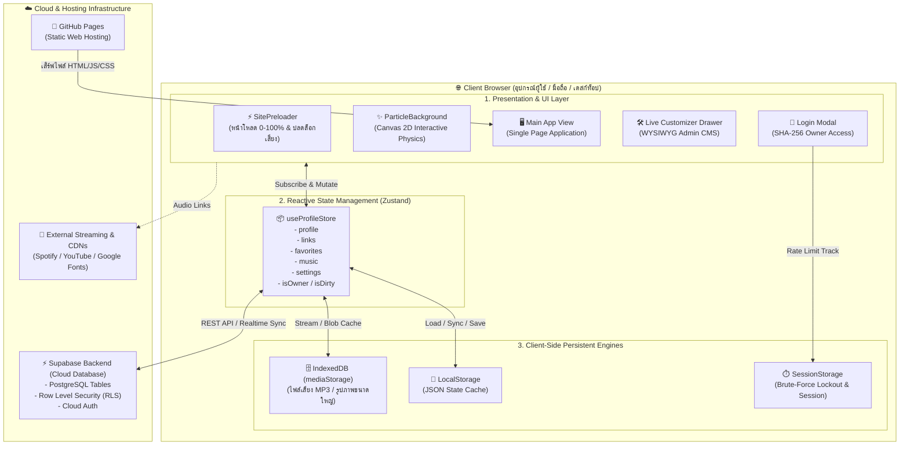
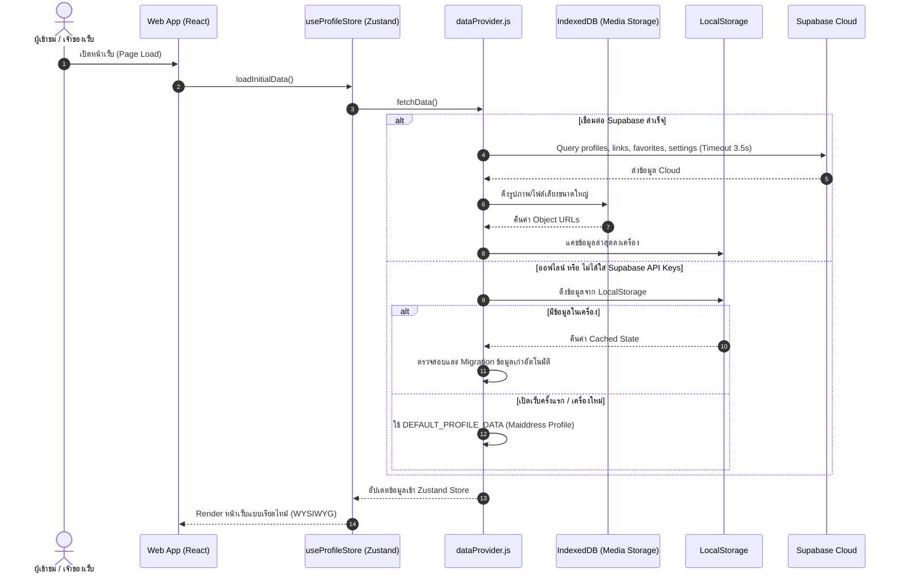
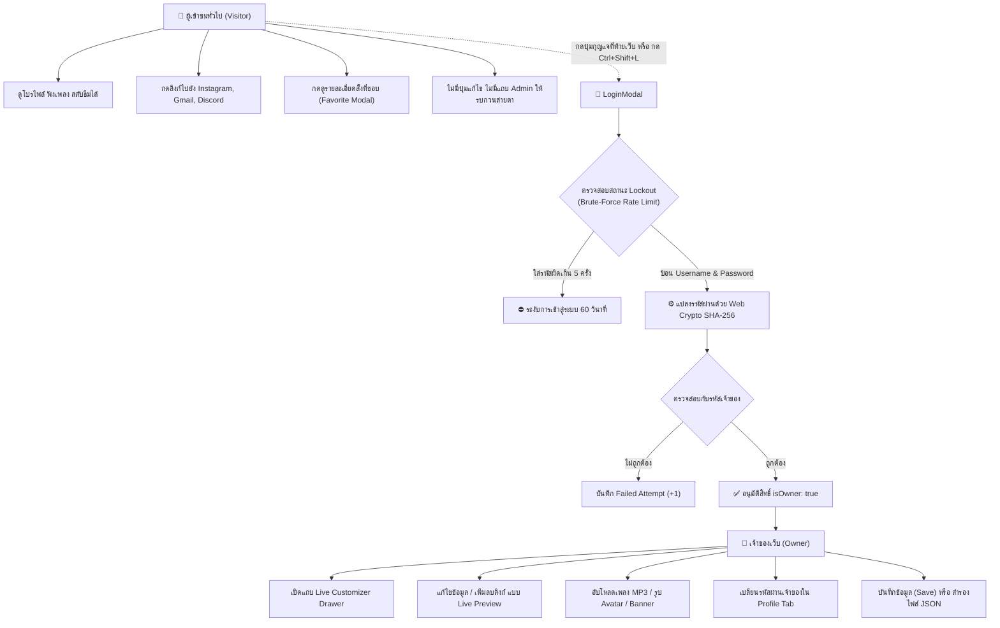

# 🗺️ แผนผังโครงสร้างสถาปัตยกรรมเว็บไซต์อย่างละเอียด (System Architecture Blueprint)
**โครงการ:** Dynamic Creative Profile & Link Hub (Maiddress Profile Hub)  
**เทคโนโลยีหลัก:** React 18, Vite, Tailwind CSS, Framer Motion, Zustand, Web Audio API, Canvas 2D, Supabase, IndexedDB

---

## 1. ภาพรวมสถาปัตยกรรมระดับระบบ (System Architecture Overview)

ระบบแบ่งออกเป็น 4 เลเยอร์หลัก: **Presentation Layer (หน้าจอแสดงผล)**, **State Management (ตัวควบคุมสถานะ)**, **Data Persistence & Cache (ระบบจัดเก็บข้อมูล)**, และ **Security & Auth (ระบบความปลอดภัย)**

---

## 2. แผนผังลำดับชั้นของคอมโพเนนต์ (Component Hierarchy Tree)

แผนภาพแสดงโครงสร้าง DOM และการจัดวางคอมโพเนนต์ภายใน [`src/App.jsx`](file:///d:/Vscode/PRO/Profile/src/App.jsx) ตั้งแต่ระดับ Root จนถึงคอมโพเนนต์ย่อย

```mermaid
flowchart TD
    Root["App.jsx (Root Application)"]

    %% Background & Preloader
    Root --> BG["✨ ParticleBackground\n(Interactive 2D Canvas Physics)"]
    Root --> Preload["⚡ SitePreloader\n(Progress Bar & Audio Unlocker)"]

    %% Top Bar
    Root --> TopBar["👑 Owner Top Bar (เฉพาะเจ้าของเมื่อ Login)"]
    TopBar --> ThemePills["🎨 ThemeSwitcher (Pills variant)"]
    TopBar --> EditBtn["✏️ Edit Hub Button"]
    TopBar --> LogoutBtn["🚪 Logout Button"]

    %% Main Card
    Root --> Container["📦 Main Layout Container"]
    Container --> Header["👤 ProfileHeader"]
    Container --> Player["🎵 MusicPlayer"]
    Container --> Links["🔗 LinksGrid"]
    Container --> Favs["⭐ FavoritesSection"]
    Container --> Social["🌐 SocialHub (Footer & Discreet Lock)"]

    %% Header Sub-elements
    Header --> Banner["🖼️ Hero Banner (Gradient / Image)"]
    Header --> Avatar["🟣 Glowing Avatar (avatar.png / Monogram)"]
    Header --> Badges["🏷️ Verified Badge & Location Pill"]
    Header --> Bio["💻 ColoredBio (Lua / JSON Syntax Highlighter)"]
    Header --> Quote["💬 Personal Quote Block"]

    %% Music Sub-elements
    Player --> Vinyl["💽 Vinyl Record (Spinning Disc & Tonearm)"]
    Player --> Soundwave["📊 SoundwaveVisualizer (Web Audio / Fallback)"]
    Player --> Controls["⏯️ Audio Controls (Play/Seek/Vol/Mute)"]
    Player --> ExtLinks["↗️ Spotify & YouTube Streaming Buttons"]

    %% Links Sub-elements
    Links --> FilterTabs["🗂️ Category Filter Tabs (All/Social/Projects/Work)"]
    Links --> LinkCards["🎴 LinkCard Component (Bento / Stack / Cards)"]

    %% Favorites Sub-elements
    Favs --> FavBadges["🏷️ Category Badges (Tech/Gaming/Anime/Hobbies)"]
    Favs --> FavCards["🃏 Favorite Cards (Tiers S/A/B)"]
    Favs -.-> FavModal["🔍 FavoriteDetailModal (Expanded View)"]

    %% Modals & CMS
    Root --> Login["🔐 LoginModal (SHA-256 Protected)"]
    Root --> Drawer["🛠️ LiveCustomizerDrawer (Slide-Over Panel)"]
    Root --> CropModal["✂️ ImageCropModal (HTML5 Canvas Image Cropper)"]

    %% Drawer Tabs
    Drawer --> Tab1["1. ProfileEditorTab (Bio, Avatar, Banner, Passwords)"]
    Drawer --> Tab2["2. LinksEditorTab (CRUD, Icons, Reorder)"]
    Drawer --> Tab3["3. FavoritesEditorTab (CRUD, Tiers, Notes)"]
    Drawer --> Tab4["4. MusicEditorTab (Audio Upload, Track Info)"]
    Drawer --> Tab5["5. LayoutThemeTab (5 Themes, 3 Layouts)"]
    Drawer --> DrawerFooter["💾 Footer (Save, Revert, Reset, Export/Import)"]
```

---

## 3. สถาปัตยกรรมข้อมูลและการซิงค์ (Data Flow & Persistence Pipeline)

ระบบใช้กลยุทธ์ **3-Tier Cascade Fallback** ร่วมกับ **Hybrid Local + Cloud Storage**:

---

## 4. แผนผังการทำงานระบบสิทธิ์และความปลอดภัย (Owner vs Visitor Flow)

เว็บมีระบบแบ่งสิทธิ์แบบ **Dual-Mode Architecture** ชัดเจน:

---

## 5. ตารางสรุปโมดูลสำคัญและตำแหน่งไฟล์

| โมดูล (Module) | ไฟล์หลัก (File Path) | หน้าที่และความรับผิดชอบหลัก |
| :--- | :--- | :--- |
| **Main Orchestrator** | [`src/App.jsx`](file:///d:/Vscode/PRO/Profile/src/App.jsx) | ควบคุมแอปพลิเคชันหลัก, จัดการ Preloader, สลับโหมด Owner/Visitor |
| **Header Identity** | [`src/components/profile/ProfileHeader.jsx`](file:///d:/Vscode/PRO/Profile/src/components/profile/ProfileHeader.jsx) | แสดง Avatar ไฟนีออน, Monogram Fallback, Handle, สถานะ, คำคม |
| **Interactive Bio** | [`src/components/profile/ColoredBio.jsx`](file:///d:/Vscode/PRO/Profile/src/components/profile/ColoredBio.jsx) | แสดง Bio โค้ดสไตล์ Lua/JSON พร้อมระบบเน้นสี Syntax Highlight |
| **Audio Turntable** | [`src/components/audio/MusicPlayer.jsx`](file:///d:/Vscode/PRO/Profile/src/components/audio/MusicPlayer.jsx) | เล่นเพลง HTML5/Web Audio, แผ่นเสียงหมุน, เข็มเล่นเพลง, ปุ่มสตรีมมิ่ง |
| **Soundwave** | [`src/components/audio/SoundwaveVisualizer.jsx`](file:///d:/Vscode/PRO/Profile/src/components/audio/SoundwaveVisualizer.jsx) | คลื่นเสียงตอบสนองต่อจังหวะเพลง พร้อมระบบ Harmonic Fallback |
| **Links Engine** | [`src/components/links/LinksGrid.jsx`](file:///d:/Vscode/PRO/Profile/src/components/links/LinksGrid.jsx) | เลย์เอาต์ลิงก์ Bento Grid / Classic Stack / Masonry Cards |
| **Favorites Hub** | [`src/components/links/FavoritesSection.jsx`](file:///d:/Vscode/PRO/Profile/src/components/links/FavoritesSection.jsx) | การ์ดสิ่งที่ชอบแบ่งตามหมวดหมู่ พร้อมแท็กระดับ Tier (S/A/B) |
| **Canvas Background**| [`src/components/canvas/ParticleBackground.jsx`](file:///d:/Vscode/PRO/Profile/src/components/canvas/ParticleBackground.jsx) | จำลองฟิสิกส์อนุภาค 2D โต้ตอบกับเมาส์และการสัมผัสบนมือถือ |
| **WYSIWYG Drawer** | [`src/components/customizer/LiveCustomizerDrawer.jsx`](file:///d:/Vscode/PRO/Profile/src/components/customizer/LiveCustomizerDrawer.jsx)| ถาดปรับแต่งสด 5 แท็บ พร้อมระบบตรวจจับ `isDirty` |
| **Security Engine** | [`src/lib/auth.js`](file:///d:/Vscode/PRO/Profile/src/lib/auth.js) | ระบบความปลอดภัย SHA-256 Hashing, Brute-Force Rate Limiting |
| **Data Cascade** | [`src/lib/dataProvider.js`](file:///d:/Vscode/PRO/Profile/src/lib/dataProvider.js) | สถาปัตยกรรมกู้คืนและแคชข้อมูล 3 ระดับ (Supabase -> Local -> Seed) |
| **Large Media Engine**| [`src/lib/mediaStorage.js`](file:///d:/Vscode/PRO/Profile/src/lib/mediaStorage.js) | จัดเก็บไฟล์เสียง MP3 และภาพ HD ใน IndexedDB ไม่กิน Quota |
| **Default Seed Data**| [`src/data/defaultData.js`](file:///d:/Vscode/PRO/Profile/src/data/defaultData.js) | ข้อมูลเริ่มต้นมาตรฐานของ Maiddress (DEV) เมื่อเปิดเว็บครั้งแรก |
